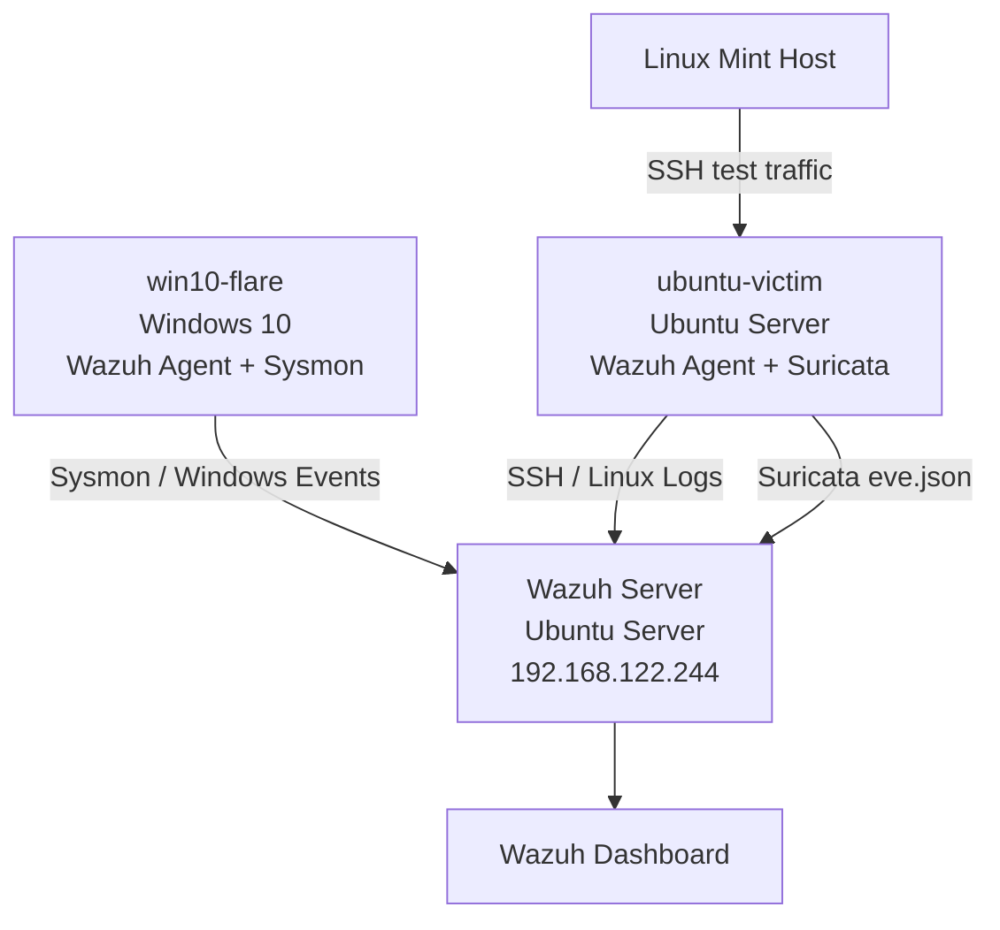

# Lab Architecture



## Components

### Wazuh Server
- Wazuh Manager
- Wazuh Indexer
- Wazuh Dashboard

### Windows Endpoint
- Windows 10
- Wazuh Agent
- Sysmon
- Registry and PowerShell monitoring

### Linux Endpoint
- Ubuntu Server
- Wazuh Agent
- OpenSSH
- Suricata IDS
- Authentication and network monitoring

## Detection Flow

```text
Activity
   ↓
Endpoint / Network Log
   ↓
Wazuh Agent / Suricata
   ↓
Wazuh Manager
   ↓
Detection Rule
   ↓
Alert
   ↓
Investigation
   ↓
MITRE ATT&CK Mapping
```