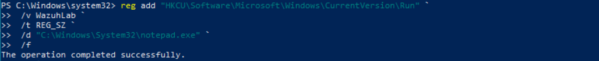
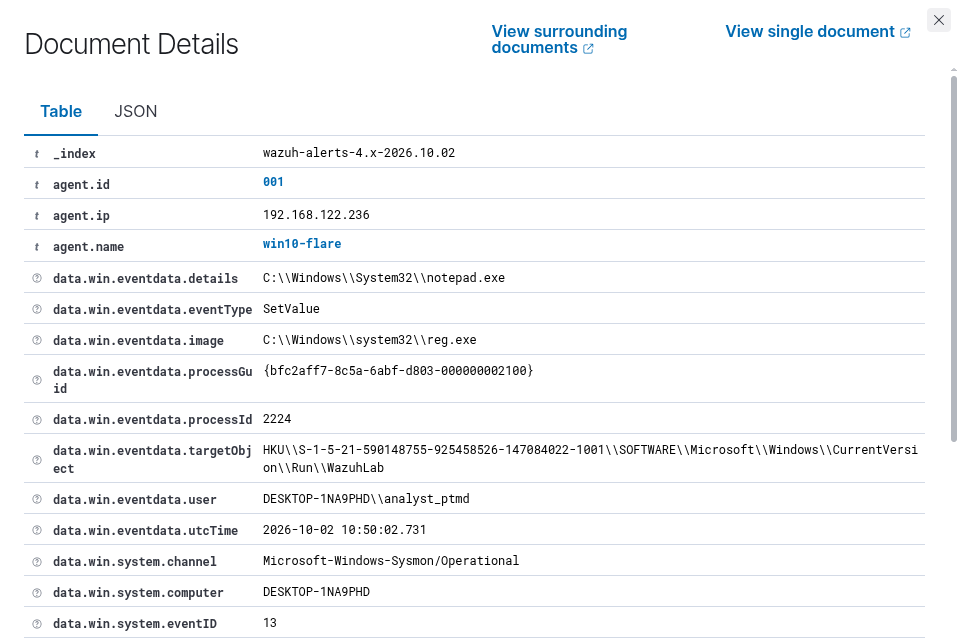
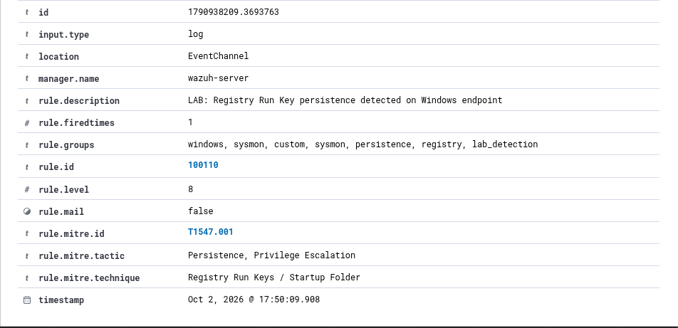

# Incident 001 - Registry Run Key Persistence

## 1. Mục tiêu

Mô phỏng và phát hiện hành vi tạo cơ chế **persistence** trên Windows thông qua **Registry Run Key**.

Registry Run Key có thể được sử dụng để tự động thực thi một chương trình khi người dùng đăng nhập vào hệ thống.

---

## 2. Môi trường

- Endpoint: `win10-flare`
- Operating System: Windows 10
- SIEM: Wazuh
- Endpoint Agent: Wazuh Agent
- Logging: Sysmon
- User: `DESKTOP-1NA9PHD\analyst_ptmd`

---

## 3. Kịch bản mô phỏng

Trên máy Windows, sử dụng `reg.exe` để tạo một Registry value trong Run Key:

```powershell
reg add "HKCU\Software\Microsoft\Windows\CurrentVersion\Run" `
 /v WazuhLab `
 /t REG_SZ `
 /d "C:\Windows\System32\notepad.exe" `
 /f
```

Registry value được tạo:

```text
Name: WazuhLab
Value: C:\Windows\System32\notepad.exe
```

Vị trí Registry:

```text
HKCU\Software\Microsoft\Windows\CurrentVersion\Run
```

Khi người dùng đăng nhập, chương trình được khai báo trong Run Key có thể được thực thi tự động.

### Bằng chứng mô phỏng



---

## 4. Log được ghi nhận

Sysmon ghi nhận thay đổi Registry bằng:

```text
Event ID: 13
Event Type: SetValue
```

Các thông tin chính trong log:

```text
Image:
C:\Windows\system32\reg.exe

TargetObject:
HKU\S-1-5-21-590148755-925458526-147084022-1001\SOFTWARE\Microsoft\Windows\CurrentVersion\Run\WazuhLab

Details:
C:\Windows\System32\notepad.exe

User:
DESKTOP-1NA9PHD\analyst_ptmd
```

Log cho thấy process `reg.exe` đã thực hiện thao tác ghi một giá trị mới vào Windows Registry Run Key.

### Registry Evidence



---

## 5. Phát hiện trên Wazuh

Wazuh nhận log Sysmon từ Wazuh Agent trên máy `win10-flare`.

Built-in rule được kích hoạt:

```text
Rule ID: 92302
Level: 6

Description:
Registry entry to be executed on next logon was modified using command line application reg.exe
```

Sau đó custom rule `100110` được xây dựng dựa trên built-in rule `92302`:

```xml
<rule id="100110" level="8">
  <if_sid>92302</if_sid>

  <description>LAB: Registry Run Key persistence detected on Windows endpoint</description>

  <mitre>
    <id>T1547.001</id>
  </mitre>

  <group>sysmon,persistence,registry,lab_detection,</group>
</rule>
```

Custom rule tạo alert:

```text
Rule ID: 100110
Level: 8
Agent: win10-flare
```

### Wazuh Alert




---

## 6. MITRE ATT&CK Mapping

- Technique ID: `T1547.001`
- Technique: `Registry Run Keys / Startup Folder`
- Tactic: `Persistence`
- Tactic: `Privilege Escalation`

Hành vi thêm Registry value vào Run Key được ánh xạ với kỹ thuật **T1547.001 - Registry Run Keys / Startup Folder**.

---

## 7. Phân tích

Dựa trên log thu thập được, process:

```text
C:\Windows\system32\reg.exe
```

đã thực hiện thao tác:

```text
Event Type: SetValue
```

tại Registry path:

```text
HKCU\Software\Microsoft\Windows\CurrentVersion\Run
```

Registry value được tạo có tên:

```text
WazuhLab
```

và trỏ đến executable:

```text
C:\Windows\System32\notepad.exe
```

Trong môi trường thực tế, Registry Run Key có thể bị malware hoặc attacker lợi dụng để duy trì khả năng thực thi sau khi người dùng đăng nhập lại.

Trong bài lab này, `notepad.exe` được sử dụng làm chương trình an toàn để mô phỏng hành vi persistence.

---

## 8. Detection Flow

```text
reg.exe
   |
   v
Windows Registry Run Key
   |
   v
Sysmon Event ID 13
   |
   v
Wazuh Agent
   |
   v
Wazuh Built-in Rule 92302
   |
   v
Custom Rule 100110
   |
   v
MITRE ATT&CK T1547.001
   |
   v
Security Alert
```

---

## 9. Kết luận

Wazuh đã phát hiện thành công hành vi thay đổi Windows Registry Run Key.

Sysmon cung cấp các thông tin phục vụ quá trình điều tra như:

- Process thực hiện thay đổi
- Registry path bị thay đổi
- Registry value được tạo
- User thực hiện hành động

Built-in rule `92302` phát hiện hành vi thay đổi Run Key bằng `reg.exe`.

Custom rule `100110` tiếp tục tạo alert ở mức `Level 8` và ánh xạ sự kiện với MITRE ATT&CK `T1547.001`.

Qua kịch bản này, quy trình xử lý cơ bản có thể được mô tả như sau:

```text
Log Collection
      |
      v
Detection
      |
      v
Alert
      |
      v
Investigation
      |
      v
MITRE ATT&CK Mapping
```

---

## 10. Khuyến nghị xử lý

Nếu phát hiện hành vi tương tự trên hệ thống thực tế, SOC Analyst có thể thực hiện:

- Kiểm tra Registry value vừa được tạo hoặc chỉnh sửa.
- Xác định process thực hiện thay đổi Registry.
- Kiểm tra executable được tham chiếu trong Registry value.
- Kiểm tra các Process Creation event liên quan.
- Xác minh user thực hiện thay đổi.
- Kiểm tra hash của executable nếu cần.
- Xóa Registry persistence entry nếu được xác định là trái phép.
- Kiểm tra thêm endpoint để tìm các dấu hiệu compromise khác.

---

## 11. Cleanup

Sau khi hoàn thành bài lab, xóa Registry value đã tạo:

```powershell
reg delete "HKCU\Software\Microsoft\Windows\CurrentVersion\Run" `
 /v WazuhLab `
 /f
```

Kiểm tra lại Run Key:

```powershell
reg query "HKCU\Software\Microsoft\Windows\CurrentVersion\Run"
```

Nếu không còn value `WazuhLab` thì môi trường đã được đưa về trạng thái trước khi mô phỏng.