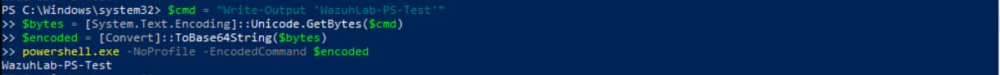
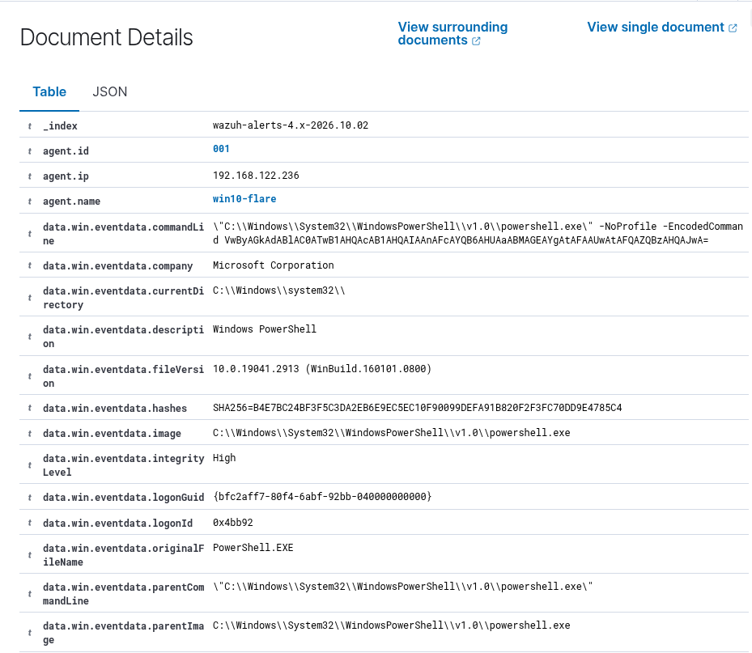
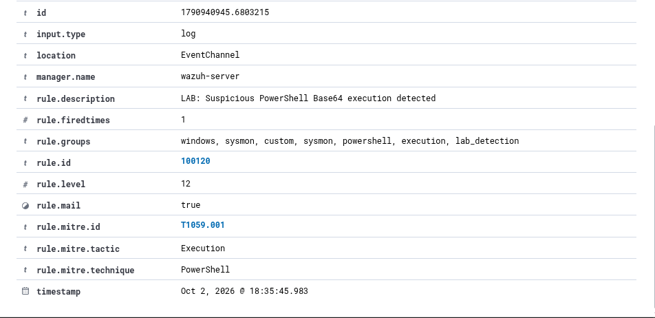

# Incident 002 - Suspicious PowerShell Base64 Execution

## 1. Mục tiêu

Mô phỏng và phát hiện hành vi thực thi PowerShell bằng tham số `-EncodedCommand`.

Kỹ thuật này thường được sử dụng để làm khó việc đọc trực tiếp command line và có thể xuất hiện trong nhiều tình huống tấn công sử dụng PowerShell.

---

## 2. Môi trường

- Endpoint: `win10-flare`
- Operating System: Windows 10
- SIEM: Wazuh
- Endpoint Agent: Wazuh Agent
- Logging: Sysmon
- User: `DESKTOP-1NA9PHD\analyst_ptmd`

---

## 3. Kịch bản mô phỏng

Một PowerShell command đơn giản được chuyển sang Base64 và thực thi bằng tham số `-EncodedCommand`.

Command gốc:

```powershell
Write-Output 'WazuhLab-PS-Test'
```

Tạo chuỗi Base64 và thực thi:

```powershell
$cmd = "Write-Output 'WazuhLab-PS-Test'"
$bytes = [System.Text.Encoding]::Unicode.GetBytes($cmd)
$encoded = [Convert]::ToBase64String($bytes)

powershell.exe -NoProfile -EncodedCommand $encoded
```

Kết quả:

```text
WazuhLab-PS-Test
```

Trong bài lab này, command được sử dụng hoàn toàn vô hại và chỉ phục vụ mục đích kiểm tra khả năng detection.

### Bằng chứng mô phỏng



---

## 4. Log được ghi nhận

Sysmon ghi nhận việc tạo process PowerShell bằng:

```text
Event ID: 1
Event Type: Process Create
```

Các thông tin đáng chú ý:

```text
Image:
C:\Windows\System32\WindowsPowerShell\v1.0\powershell.exe
```

Command line:

```text
powershell.exe -NoProfile -EncodedCommand ...
```

User:

```text
DESKTOP-1NA9PHD\analyst_ptmd
```

Integrity Level:

```text
High
```

Parent Process:

```text
C:\Windows\System32\WindowsPowerShell\v1.0\powershell.exe
```

Sysmon cũng ghi nhận SHA256 của process phục vụ quá trình điều tra.

### Process Evidence



---

## 5. Phát hiện trên Wazuh

Wazuh nhận Sysmon Event ID 1 từ endpoint `win10-flare`.

Built-in rule được kích hoạt:

```text
Rule ID: 92057
Level: 12

Description:
Powershell.exe spawned a powershell process which executed a base64 encoded command
```

Built-in rule đã ánh xạ sự kiện với:

```text
MITRE ATT&CK: T1059.001
Technique: PowerShell
Tactic: Execution
```

Sau đó custom rule `100120` được xây dựng dựa trên rule `92057`:

```xml
<rule id="100120" level="12">
  <if_sid>92057</if_sid>

  <description>LAB: Suspicious PowerShell Base64 execution detected</description>

  <mitre>
    <id>T1059.001</id>
  </mitre>

  <group>sysmon,powershell,execution,lab_detection,</group>
</rule>
```

Custom rule tạo alert:

```text
Rule ID: 100120
Level: 12

Description:
LAB: Suspicious PowerShell Base64 execution detected
```

### Wazuh Alert



---

## 6. MITRE ATT&CK Mapping

- Technique ID: `T1059.001`
- Technique: `PowerShell`
- Tactic: `Execution`

PowerShell là một command and scripting interpreter có thể được sử dụng cho nhiều hoạt động quản trị hợp lệ nhưng cũng thường bị attacker lợi dụng để thực thi command hoặc script.

Việc sử dụng `-EncodedCommand` không tự động đồng nghĩa với malicious activity, nhưng đây là một dấu hiệu cần được kiểm tra trong quá trình alert triage.

---

## 7. Phân tích

Log cho thấy process:

```text
C:\Windows\System32\WindowsPowerShell\v1.0\powershell.exe
```

được khởi tạo với command line chứa:

```text
-NoProfile -EncodedCommand
```

Tham số `-EncodedCommand` cho phép PowerShell nhận command dưới dạng Base64 thay vì plaintext.

Trong sự kiện này:

- Sysmon ghi nhận process creation bằng Event ID 1.
- Command line chứa chuỗi Base64.
- Parent process cũng là `powershell.exe`.
- Process được thực thi bởi user `analyst_ptmd`.
- Integrity Level được ghi nhận là `High`.

Trong bài lab, nội dung sau khi decode chỉ là:

```powershell
Write-Output 'WazuhLab-PS-Test'
```

Do đó đây là một hoạt động mô phỏng và không phải hành vi malicious thực tế.

Tuy nhiên, trong môi trường production, SOC Analyst cần tiếp tục decode nội dung, kiểm tra parent process, user, network connection và các event liên quan trước khi đưa ra kết luận.

---

## 8. Detection Flow

```text
PowerShell
   |
   v
-EncodedCommand
   |
   v
Sysmon Event ID 1
   |
   v
Wazuh Agent
   |
   v
Built-in Rule 92057
   |
   v
Custom Rule 100120
   |
   v
MITRE ATT&CK T1059.001
   |
   v
Level 12 Alert
```

---

## 9. Kết luận

Wazuh đã phát hiện thành công PowerShell process sử dụng Base64 encoded command.

Sysmon cung cấp các thông tin quan trọng phục vụ điều tra như:

- Process image
- Command line
- Parent process
- User
- Integrity Level
- Process hash

Built-in rule `92057` phát hiện trực tiếp hành vi PowerShell thực thi Base64 encoded command.

Custom rule `100120` được sử dụng để tạo detection riêng cho môi trường lab và giữ mapping với MITRE ATT&CK `T1059.001`.

Qua kịch bản này có thể thực hành quy trình:

```text
Process Monitoring
       |
       v
Detection
       |
       v
Alert Triage
       |
       v
Command Analysis
       |
       v
MITRE ATT&CK Mapping
```

---

## 10. Khuyến nghị xử lý

Nếu gặp alert tương tự trong môi trường thực tế, SOC Analyst có thể:

- Kiểm tra toàn bộ PowerShell command line.
- Decode nội dung Base64 để xác định command thực tế.
- Kiểm tra parent process.
- Xác minh user thực hiện hành động.
- Kiểm tra Integrity Level.
- Kiểm tra process hash.
- Tìm các process được tạo tiếp theo.
- Kiểm tra network connection liên quan.
- Correlate với các Sysmon event khác trên cùng endpoint.
- Xác định hành vi là legitimate hay suspicious trước khi escalation.

---

## 11. Kết quả

Incident được phát hiện thành công với:

```text
Sysmon Event ID: 1
Built-in Rule: 92057
Custom Rule: 100120
Alert Level: 12
MITRE ATT&CK: T1059.001 - PowerShell
```