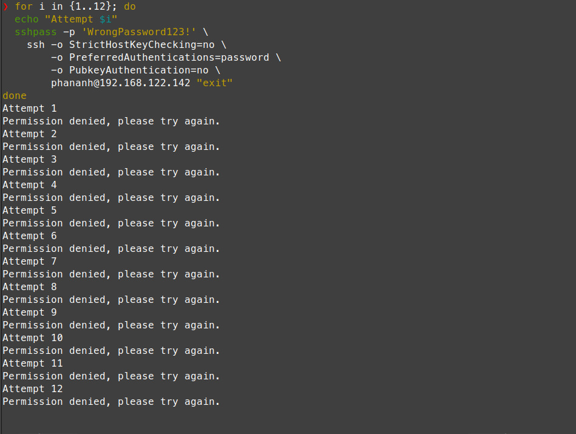
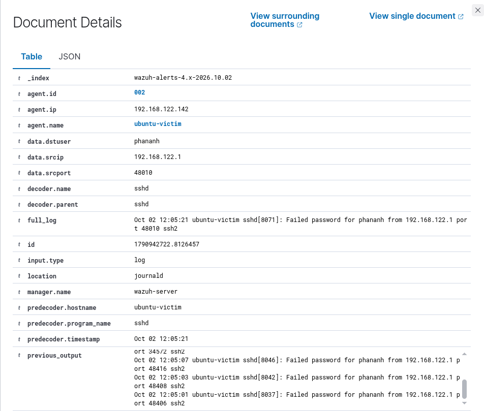
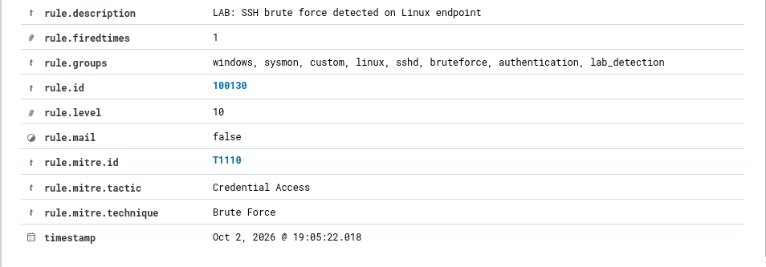

# Incident 003 - SSH Brute Force Detection

## 1. Mục tiêu

Mô phỏng và phát hiện hành vi **SSH Brute Force** trên Linux bằng cách thực hiện nhiều lần đăng nhập SSH với mật khẩu không chính xác.

Mục tiêu của bài lab là theo dõi authentication log, phát hiện nhiều lần đăng nhập thất bại và tạo alert trên Wazuh.

---

## 2. Môi trường

- Target: `ubuntu-victim`
- Operating System: Ubuntu Server 24.04
- Target IP: `192.168.122.142`
- SIEM: Wazuh
- Endpoint Agent: Wazuh Agent
- Service: OpenSSH
- Target User: `phananh`

---

## 3. Kịch bản mô phỏng

Từ Linux host, thực hiện nhiều lần đăng nhập SSH vào `ubuntu-victim` bằng mật khẩu không chính xác.

Lệnh mô phỏng:

```bash
for i in {1..12}; do
  echo "Attempt $i"
  sshpass -p 'WrongPassword123!' \
    ssh -o StrictHostKeyChecking=no \
        -o PreferredAuthentications=password \
        -o PubkeyAuthentication=no \
        phananh@192.168.122.142 "exit"
done
```

Mỗi lần đăng nhập sử dụng mật khẩu sai sẽ trả về:

```text
Permission denied, please try again.
```

Nhiều authentication failure liên tiếp được tạo nhằm mô phỏng hành vi thử mật khẩu nhiều lần vào dịch vụ SSH.

### Bằng chứng mô phỏng



---

## 4. Log được ghi nhận

Ubuntu ghi nhận các lần đăng nhập SSH thất bại.

Ví dụ:

```text
Failed password for phananh from 192.168.122.1 port 47994 ssh2
Failed password for phananh from 192.168.122.1 port 34580 ssh2
Failed password for phananh from 192.168.122.1 port 34578 ssh2
Failed password for phananh from 192.168.122.1 port 34572 ssh2
```

Các thông tin chính:

```text
Service:
sshd

Source IP:
192.168.122.1

Target User:
phananh

Event:
Failed password
```

Wazuh Agent trên `ubuntu-victim` thu thập các authentication event này và gửi về Wazuh Manager.

### Authentication Evidence



---

## 5. Phát hiện trên Wazuh

Đối với từng lần đăng nhập thất bại, Wazuh kích hoạt built-in rule:

```text
Rule ID: 5760
Level: 5

Description:
sshd: authentication failed.
```

Sau nhiều authentication failure liên tiếp, Wazuh thực hiện correlation và kích hoạt:

```text
Rule ID: 5763
Level: 10

Description:
sshd: brute force trying to get access to the system. Authentication failed.
```

Custom rule `100130` được xây dựng dựa trên built-in rule `5763`:

```xml
<rule id="100130" level="10">
  <if_sid>5763</if_sid>

  <description>LAB: SSH brute force detected on Linux endpoint</description>

  <mitre>
    <id>T1110</id>
  </mitre>

  <group>linux,sshd,bruteforce,authentication,lab_detection,</group>
</rule>
```

Custom rule tạo alert:

```text
Rule ID: 100130
Level: 10
Agent: ubuntu-victim

Description:
LAB: SSH brute force detected on Linux endpoint
```

### Wazuh Alert



---

## 6. MITRE ATT&CK Mapping

- Technique ID: `T1110`
- Technique: `Brute Force`
- Tactic: `Credential Access`

Brute Force là kỹ thuật thử nhiều credential hoặc password nhằm giành quyền truy cập vào một tài khoản hoặc hệ thống.

Trong bài lab này, nhiều mật khẩu không chính xác được sử dụng liên tiếp đối với cùng một tài khoản SSH để tạo hành vi mô phỏng.

---

## 7. Phân tích

Wazuh ghi nhận nhiều authentication failure từ:

```text
Source IP:
192.168.122.1
```

nhắm tới:

```text
Host:
ubuntu-victim

User:
phananh
```

Các event riêng lẻ ban đầu kích hoạt rule `5760`:

```text
sshd: authentication failed.
```

Khi số lượng authentication failure tăng lên trong một khoảng thời gian ngắn, Wazuh correlate các event và kích hoạt rule `5763`:

```text
sshd: brute force trying to get access to the system.
Authentication failed.
```

Alert của custom rule `100130` còn chứa `previous_output`, cho phép SOC Analyst quan sát nhiều authentication failure liên tiếp trước khi brute-force alert được tạo.

Ví dụ:

```text
Failed password for phananh from 192.168.122.1 ...
Failed password for phananh from 192.168.122.1 ...
Failed password for phananh from 192.168.122.1 ...
```

Điều này cho thấy alert không được tạo từ một login failure đơn lẻ mà dựa trên nhiều authentication failure liên tiếp.

---

## 8. Detection Flow

```text
Repeated SSH Login Attempts
          |
          v
SSH Authentication Failure
          |
          v
Linux Authentication Logs
          |
          v
Wazuh Agent
          |
          v
Rule 5760
Individual Authentication Failure
          |
          v
Rule 5763
SSH Brute Force Correlation
          |
          v
Custom Rule 100130
          |
          v
MITRE ATT&CK T1110
          |
          v
Level 10 Alert
```

---

## 9. Alert Triage

Các trường quan trọng cần kiểm tra khi phân tích alert:

```text
agent.name:
ubuntu-victim

data.srcip:
192.168.122.1

data.srcport:
48010

data.dstuser:
phananh

decoder.name:
sshd

location:
journald
```

Ngoài ra cần kiểm tra `previous_output` để xác định số lượng và tần suất các authentication failure trước khi alert được tạo.

Trong môi trường thực tế, SOC Analyst cần tiếp tục xác minh:

- Source IP có hợp lệ hay không.
- Tài khoản bị nhắm tới.
- Số lượng authentication failure.
- Khoảng thời gian giữa các lần đăng nhập.
- Có successful login sau chuỗi failed login hay không.
- Source IP có thử đăng nhập vào nhiều tài khoản khác hay không.
- Có hoạt động bất thường nào xảy ra sau quá trình authentication hay không.

---

## 10. Kết luận

Wazuh đã phát hiện thành công nhiều lần SSH authentication failure và correlate các event thành một SSH brute-force alert.

Kết quả:

```text
Individual Failure Rule: 5760
Brute Force Rule: 5763
Custom Rule: 100130
Alert Level: 10
MITRE ATT&CK: T1110 - Brute Force
Tactic: Credential Access
```

Bài lab thể hiện quy trình từ authentication log đến detection và alert correlation:

```text
Authentication Log
        |
        v
Individual Detection
        |
        v
Event Correlation
        |
        v
Brute Force Alert
        |
        v
Alert Triage
        |
        v
MITRE ATT&CK Mapping
```

---

## 11. Khuyến nghị xử lý

Nếu phát hiện SSH brute-force tương tự trong môi trường thực tế, SOC Analyst có thể:

- Xác định source IP thực hiện các login attempt.
- Kiểm tra tài khoản bị nhắm tới.
- Xác định số lượng và tần suất authentication failure.
- Kiểm tra successful login xảy ra sau chuỗi failed login.
- Kiểm tra các hoạt động của tài khoản nếu có login thành công.
- Kiểm tra source IP có nhắm tới nhiều user hoặc endpoint khác không.
- Block source IP nếu được xác định là malicious.
- Kiểm tra và tăng cường password policy.
- Sử dụng SSH key thay cho password authentication khi phù hợp.
- Áp dụng rate limiting hoặc cơ chế chống brute force như Fail2ban nếu cần.
- Tiếp tục theo dõi endpoint để phát hiện các hành vi bất thường tiếp theo.

---

## 12. Kết quả bài lab

Incident 003 đã hoàn thành với các thành phần:

```text
Linux SSH authentication monitoring
Wazuh log collection
Authentication failure detection
Brute-force event correlation
Custom detection rule
Alert triage
MITRE ATT&CK mapping
Incident documentation
```