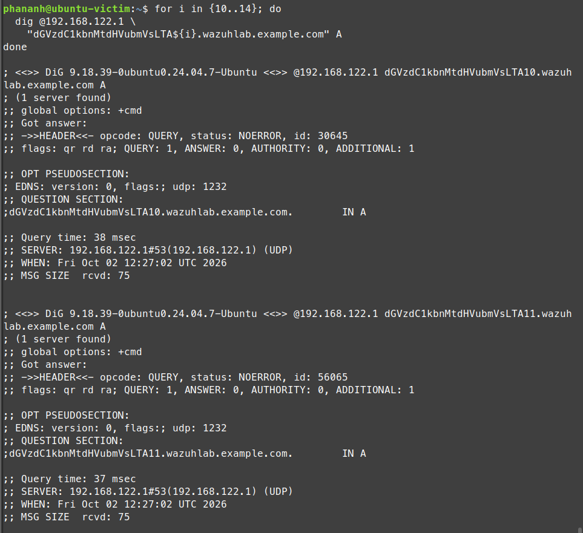
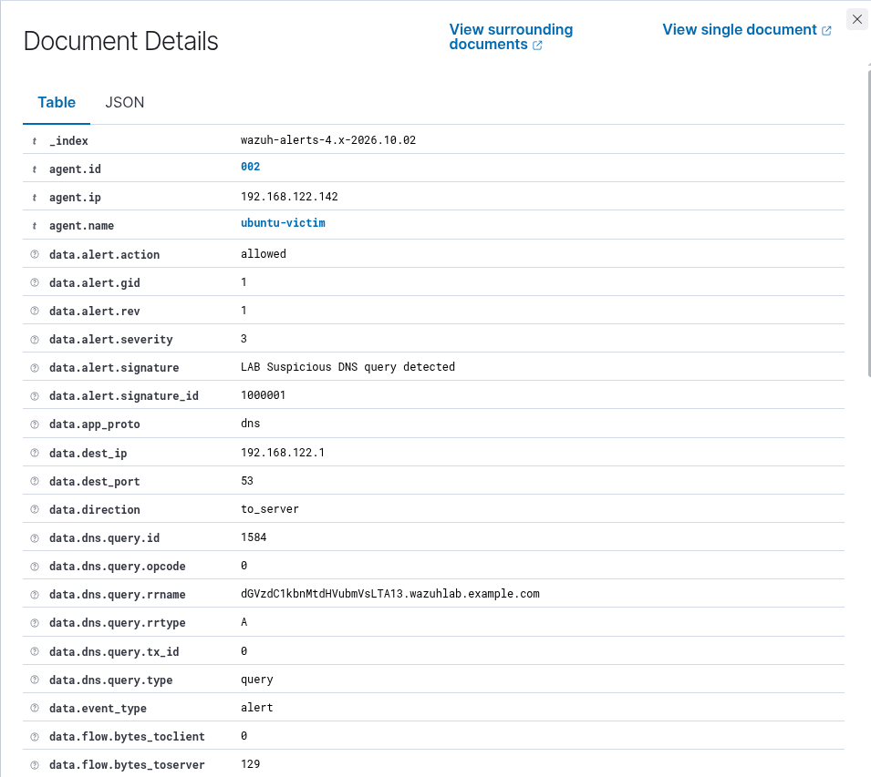
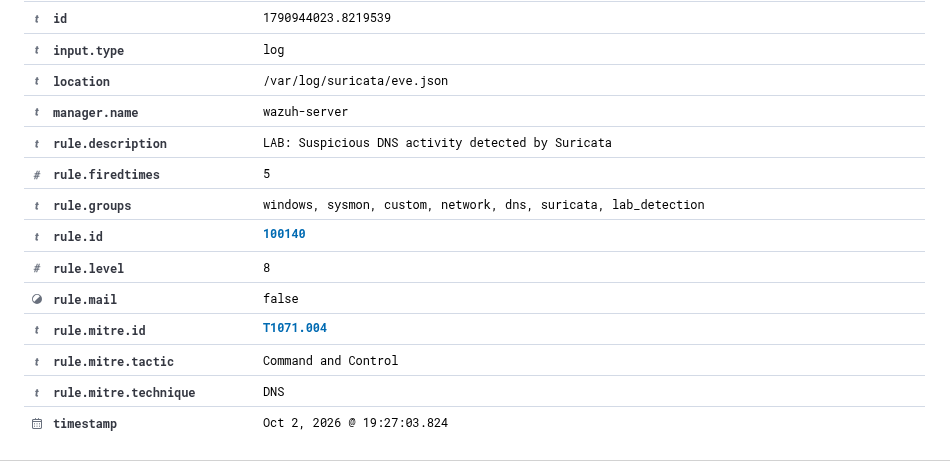

# Incident 004 - Suspicious DNS Activity Detection

## 1. Mục tiêu

Mô phỏng và phát hiện DNS traffic có đặc điểm bất thường bằng **Suricata IDS** và chuyển alert về **Wazuh SIEM** để thực hiện monitoring và investigation.

Bài lab sử dụng một domain giả trong môi trường thử nghiệm nhằm mô phỏng DNS query có subdomain dạng encoded.

---

## 2. Môi trường

- Endpoint: `ubuntu-victim`
- Operating System: Ubuntu Server 24.04
- Endpoint IP: `192.168.122.142`
- DNS Server: `192.168.122.1`
- SIEM: Wazuh
- Network IDS: Suricata
- Network Interface: `enp1s0`
- Protocol: DNS / UDP
- Destination Port: `53`

---

## 3. Kịch bản mô phỏng

Trên `ubuntu-victim`, thực hiện nhiều DNS query tới domain giả:

```bash
for i in {10..14}; do
  dig @192.168.122.1 \
    "dGVzdC1kbnMtdHVubmVsLTA${i}.wazuhlab.example.com" A
done
```

Ví dụ DNS query:

```text
dGVzdC1kbnMtdHVubmVsLTA10.wazuhlab.example.com
```

Phần subdomain được tạo có dạng giống encoded data để mô phỏng DNS traffic cần được SOC Analyst kiểm tra.

Domain `wazuhlab.example.com` chỉ được sử dụng trong môi trường lab và không đại diện cho một domain malicious thực tế.

### Bằng chứng mô phỏng



---

## 4. Suricata Detection Rule

Một custom Suricata rule được tạo để phát hiện DNS query chứa domain thử nghiệm:

```text
alert dns any any -> any any (msg:"LAB Suspicious DNS query detected"; dns.query; content:"wazuhlab.example.com"; nocase; sid:1000001; rev:1;)
```

Các thành phần chính:

```text
Protocol:
DNS

Match:
wazuhlab.example.com

Suricata SID:
1000001

Message:
LAB Suspicious DNS query detected
```

Khi DNS query phù hợp với rule, Suricata tạo alert và ghi event vào:

```text
/var/log/suricata/eve.json
```

---

## 5. Log được ghi nhận

Suricata ghi nhận DNS traffic với các thông tin:

```text
Source IP:
192.168.122.142

Destination IP:
192.168.122.1

Destination Port:
53

Protocol:
UDP

Application Protocol:
DNS
```

DNS query:

```text
dGVzdC1kbnMtdHVubmVsLTA13.wazuhlab.example.com
```

Suricata alert:

```text
Signature:
LAB Suspicious DNS query detected

Signature ID:
1000001
```

### Network Evidence



---

## 6. Tích hợp Suricata với Wazuh

Wazuh Agent được cấu hình để đọc Suricata `eve.json`:

```xml
<localfile>
  <log_format>json</log_format>
  <location>/var/log/suricata/eve.json</location>
</localfile>
```

Khi Suricata tạo alert, Wazuh nhận JSON event và kích hoạt built-in rule:

```text
Rule ID: 86601
Level: 3

Description:
Suricata: Alert - LAB Suspicious DNS query detected
```

---

## 7. Custom Wazuh Rule

Custom rule `100140` được xây dựng dựa trên Suricata built-in rule `86601`.

```xml
<rule id="100140" level="8">
  <if_sid>86601</if_sid>

  <field name="alert.signature_id">^1000001$</field>

  <description>LAB: Suspicious DNS activity detected by Suricata</description>

  <mitre>
    <id>T1071.004</id>
  </mitre>

  <group>dns,lab_detection,</group>
</rule>
```

Custom rule chỉ được kích hoạt khi:

```text
Suricata signature_id = 1000001
```

Alert được tạo:

```text
Rule ID: 100140
Level: 8

Description:
LAB: Suspicious DNS activity detected by Suricata
```

### Wazuh Alert



---

## 8. MITRE ATT&CK Mapping

- Technique ID: `T1071.004`
- Technique: `DNS`
- Tactic: `Command and Control`

DNS là giao thức hợp lệ và được sử dụng thường xuyên trong hệ thống mạng.

Tuy nhiên, attacker có thể lợi dụng DNS để truyền dữ liệu hoặc phục vụ Command and Control.

Trong bài lab này, các DNS query chỉ mô phỏng traffic có đặc điểm đáng chú ý. Việc một DNS query chứa chuỗi encoded không đủ để kết luận endpoint đang thực hiện DNS tunneling hoặc Command and Control thực tế.

---

## 9. Phân tích

Suricata quan sát traffic trên interface:

```text
enp1s0
```

và phát hiện DNS query từ:

```text
192.168.122.142
```

đến DNS server:

```text
192.168.122.1:53
```

Query chứa:

```text
wazuhlab.example.com
```

nên custom Suricata rule `SID 1000001` được kích hoạt.

Alert sau đó được ghi vào:

```text
/var/log/suricata/eve.json
```

Wazuh Agent đọc file JSON và gửi event tới Wazuh Manager.

Built-in rule `86601` nhận diện Suricata alert, sau đó custom rule `100140` tạo alert ở mức `Level 8` và ánh xạ với MITRE ATT&CK `T1071.004`.

---

## 10. Detection Flow

```text
DNS Query
   |
   v
Network Interface enp1s0
   |
   v
Suricata IDS
   |
   v
Custom Suricata Rule
SID 1000001
   |
   v
eve.json
   |
   v
Wazuh Agent
   |
   v
Built-in Rule 86601
   |
   v
Custom Rule 100140
   |
   v
MITRE ATT&CK T1071.004
   |
   v
Level 8 Alert
```

---

## 11. Alert Triage

Các trường quan trọng khi phân tích alert:

```text
agent.name:
ubuntu-victim

data.src_ip:
192.168.122.142

data.dest_ip:
192.168.122.1

data.dest_port:
53

data.proto:
UDP

data.app_proto:
dns

data.alert.signature_id:
1000001

data.alert.signature:
LAB Suspicious DNS query detected

data.dns.query.rrname:
dGVzdC1kbnMtdHVubmVsLTA13.wazuhlab.example.com
```

SOC Analyst cần xem xét thêm:

- Domain được truy vấn.
- Độ dài và cấu trúc subdomain.
- Tần suất DNS query.
- Source endpoint tạo traffic.
- DNS server được sử dụng.
- Các domain khác được endpoint truy vấn.
- Network connection xảy ra trước và sau DNS activity.
- Process tạo DNS traffic nếu có endpoint telemetry tương ứng.

---

## 12. Kết luận

Suricata đã phát hiện thành công DNS traffic phù hợp với custom network detection rule.

Alert sau đó được chuyển tới Wazuh và xử lý thông qua cả built-in rule và custom rule.

Kết quả:

```text
Suricata SID: 1000001
Wazuh Built-in Rule: 86601
Wazuh Custom Rule: 100140
Alert Level: 8
MITRE ATT&CK: T1071.004 - DNS
Tactic: Command and Control
```

Bài lab thể hiện quá trình:

```text
Network Traffic
      |
      v
Network IDS Detection
      |
      v
JSON Log Collection
      |
      v
SIEM Alert
      |
      v
Alert Triage
      |
      v
MITRE ATT&CK Mapping
```

---

## 13. Khuyến nghị xử lý

Nếu phát hiện DNS activity tương tự trong môi trường thực tế, SOC Analyst có thể:

- Kiểm tra domain và subdomain được truy vấn.
- Xác minh reputation của domain.
- Kiểm tra tần suất DNS query.
- Tìm các query có entropy hoặc độ dài bất thường.
- Kiểm tra endpoint tạo DNS traffic.
- Correlate với process và network connection liên quan.
- Kiểm tra các endpoint khác có truy vấn cùng domain không.
- Capture PCAP nếu cần phân tích traffic sâu hơn.
- Block domain hoặc endpoint khi có đủ bằng chứng malicious.
- Tiếp tục investigation trước khi kết luận DNS tunneling hoặc C2.

---

## 14. Kết quả bài lab

Incident 004 đã hoàn thành với:

```text
DNS traffic generation
Suricata network monitoring
Custom Suricata detection rule
eve.json analysis
Suricata - Wazuh integration
Custom Wazuh detection rule
Alert triage
MITRE ATT&CK mapping
Incident documentation
```